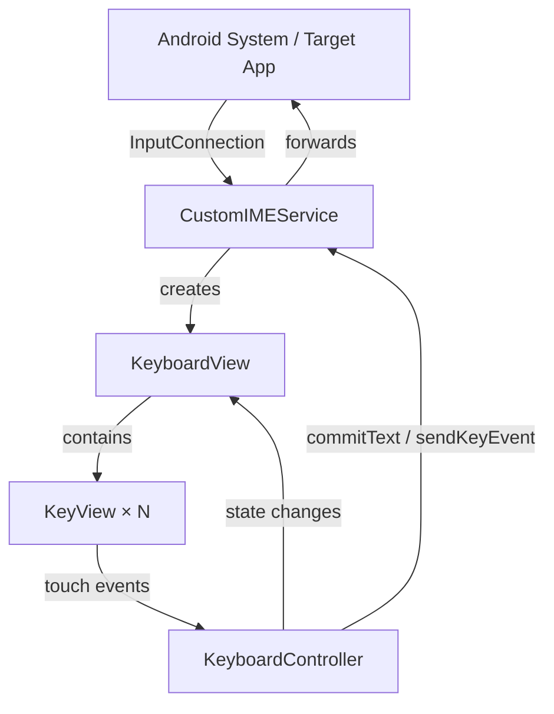

# Design Document: Android Custom Keyboard

## Overview

This document describes the technical design for a custom Android Input Method Editor (IME) styled after Google's Gboard. The application is built using Android's `InputMethodService` framework and provides a full QWERTY keyboard experience with a numbers/symbols layer, shift/caps lock, backspace with repeat, space, and a context-aware enter key. A GitHub Actions CI/CD pipeline builds and packages the APK with Gradle caching for fast incremental builds.

The keyboard is implemented as a standalone Android application (APK) that registers itself as a system IME. Users enable it through Android's language and input settings, after which it becomes available as an input method in any app.

### Key Design Goals

- **Correctness**: Key input must be reliably committed to the `InputConnection` with no dropped or duplicated characters.
- **Responsiveness**: Touch feedback must appear within 16ms; the keyboard must not block the main thread.
- **Familiarity**: Visual design mirrors Gboard's Material Blue Grey palette and layout conventions.
- **Maintainability**: Clear separation between IME lifecycle, key event logic, and view rendering.
- **Fast CI**: Gradle wrapper and dependency caching keeps CI build times well below cold-build baselines.

---

## Architecture

The application follows a layered architecture with three primary concerns:

1. **IME Service Layer** — `InputMethodService` subclass that manages the Android IME lifecycle, creates the keyboard view, and routes input events to the `InputConnection`.
2. **Keyboard Logic Layer** — Pure state management for `Shift_State`, layer switching (QWERTY ↔ Symbol), and backspace repeat timing. This layer has no Android UI dependencies, making it independently testable.
3. **View Layer** — Custom `View` subclasses (`KeyView`, `KeyboardView`) that render keys and dispatch touch events back to the logic layer.



### Threading Model

- All view rendering and touch handling runs on the **main thread**.
- Backspace repeat uses `Handler.postDelayed` on the main thread — no background threads are needed.
- `InputConnection` calls (`commitText`, `deleteSurroundingText`, `sendKeyEvent`) are made on the main thread, which is the correct approach for IME services.

---

## Components and Interfaces

### CustomIMEService

Extends `InputMethodService`. Responsibilities:

- Override `onCreateInputView()` to inflate and return the `KeyboardView`.
- Override `onStartInputView(EditorInfo, boolean)` to pass `imeOptions` to the `KeyboardController` so the Enter key label updates.
- Expose `getInputConnectionWrapper()` for the controller to call `commitText` and `deleteSurroundingText`.

```kotlin
class CustomIMEService : InputMethodService() {
    private lateinit var controller: KeyboardController

    override fun onCreateInputView(): View
    override fun onStartInputView(info: EditorInfo, restarting: Boolean)
}
```

### KeyboardController

Pure Kotlin class (no Android context dependency). Manages all keyboard state and dispatches actions.

```kotlin
class KeyboardController(
    private val inputActions: InputActions,
    private val viewActions: ViewActions
) {
    var shiftState: ShiftState = ShiftState.OFF
    var currentLayer: KeyboardLayer = KeyboardLayer.QWERTY

    fun onKeyTapped(key: Key)
    fun onBackspaceDown()
    fun onBackspaceUp()
    fun onShiftTapped()
    // internal: scheduleRepeat(), cancelRepeat()
}

interface InputActions {
    fun commitText(text: String)
    fun deleteCharBefore()
    fun performEditorAction(actionCode: Int)
}

interface ViewActions {
    fun updateShiftIndicator(state: ShiftState)
    fun switchLayer(layer: KeyboardLayer)
    fun showKeyPreview(key: Key)
    fun dismissKeyPreview()
    fun updateEnterLabel(imeOptions: Int)
}
```

### KeyboardView

Custom `ViewGroup` that inflates the key grid for the active layer. Responsibilities:

- Render the correct layer (QWERTY or Symbol) based on `currentLayer`.
- Contain and lay out `KeyView` instances.
- Forward touch events to `KeyboardController`.
- Display the key popup preview overlay.

### KeyView

Custom `View` for a single key. Responsibilities:

- Draw rounded-rectangle background with correct colour for normal/pressed states.
- Draw key label (letter, symbol, or icon drawable).
- Report touch down/up events to `KeyboardView`.

### Key Data Model

Keys are defined as data classes rather than XML keyboard definitions, giving full programmatic control:

```kotlin
sealed class Key {
    data class Letter(val char: Char) : Key()
    data class Symbol(val char: Char) : Key()
    data class Action(val type: ActionType) : Key()
}

enum class ActionType {
    SHIFT, BACKSPACE, SPACE, ENTER, SWITCH_TO_SYMBOLS, SWITCH_TO_QWERTY
}

enum class ShiftState { OFF, SINGLE, CAPS_LOCK }
enum class KeyboardLayer { QWERTY, SYMBOL }
```

---

## Data Models

### Keyboard Layout Definition

Layouts are defined as immutable lists of rows, each row being a list of `Key` objects. This makes them easy to test and modify without touching view code.

```kotlin
object QwertyLayout {
    val rows: List<List<Key>> = listOf(
        listOf(Letter('q'), Letter('w'), Letter('e'), Letter('r'), Letter('t'),
               Letter('y'), Letter('u'), Letter('i'), Letter('o'), Letter('p')),
        listOf(Letter('a'), Letter('s'), Letter('d'), Letter('f'), Letter('g'),
               Letter('h'), Letter('j'), Letter('k'), Letter('l')),
        listOf(Action(SHIFT), Letter('z'), Letter('x'), Letter('c'), Letter('v'),
               Letter('b'), Letter('n'), Letter('m'), Action(BACKSPACE)),
        listOf(Action(SWITCH_TO_SYMBOLS), Action(SPACE), Action(ENTER))
    )
}

object SymbolLayout {
    val rows: List<List<Key>> = listOf(
        listOf(Symbol('1'), Symbol('2'), Symbol('3'), Symbol('4'), Symbol('5'),
               Symbol('6'), Symbol('7'), Symbol('8'), Symbol('9'), Symbol('0')),
        listOf(Symbol('!'), Symbol('@'), Symbol('#'), Symbol('$'), Symbol('%'),
               Symbol('^'), Symbol('&'), Symbol('*'), Symbol('('), Symbol(')')),
        listOf(Symbol('-'), Symbol('_'), Symbol('='), Symbol('+'), Symbol('['),
               Symbol(']'), Symbol('{'), Symbol('}'), Symbol(';'), Symbol(':')),
        listOf(Symbol('\''), Symbol('"'), Symbol(','), Symbol('.'), Symbol('<'),
               Symbol('>'), Symbol('/'), Symbol('?'), Symbol('\\'), Symbol('|')),
        listOf(Action(SWITCH_TO_QWERTY), Action(SPACE), Action(BACKSPACE))
    )
}
```

### Shift State Transition Table

| Current State | Event | Next State |
|---|---|---|
| `OFF` | Single tap | `SINGLE` |
| `SINGLE` | Single tap | `OFF` |
| `OFF` or `SINGLE` | Double tap (≤400ms) | `CAPS_LOCK` |
| `CAPS_LOCK` | Single tap | `OFF` |

### Backspace Repeat Timing

- Initial delay before repeat begins: **400ms**
- Repeat interval: **50ms**
- Implemented via `Handler.postDelayed` chain; cancelled on `ACTION_UP`.

### Enter Key Action Mapping

| `imeOptions` flag | Label displayed |
|---|---|
| `IME_ACTION_DONE` | "Done" |
| `IME_ACTION_SEARCH` | "Search" |
| `IME_ACTION_SEND` | "Send" |
| `IME_ACTION_GO` | "Go" |
| `IME_ACTION_NEXT` | "Next" |
| None / default | ↵ (return arrow icon) |

### CI/CD Pipeline State

The GitHub Actions workflow has no runtime state model — it is a declarative YAML configuration. Key parameters:

| Parameter | Value |
|---|---|
| Trigger branches | `main` (push + PR) |
| JDK version | 17 |
| Gradle task | `assembleDebug --build-cache` |
| Artifact retention | 7 days |
| Wrapper cache key | `${{ runner.os }}-gradle-wrapper-${{ hashFiles('gradle/wrapper/gradle-wrapper.properties') }}` |
| Deps cache key | `${{ runner.os }}-gradle-deps-${{ hashFiles('**/*.gradle*', '**/gradle-wrapper.properties') }}` |

---

## Correctness Properties

*A property is a characteristic or behavior that should hold true across all valid executions of a system — essentially, a formal statement about what the system should do. Properties serve as the bridge between human-readable specifications and machine-verifiable correctness guarantees.*

The keyboard logic layer (`KeyboardController`) is a pure state machine with clear input/output behavior, making it well-suited for property-based testing. The UI rendering and CI/CD configuration sections are not suitable for PBT and are covered by example-based and smoke tests instead.

### Property 1: Letter commit respects shift state

*For any* letter key and any shift state (`OFF`, `SINGLE`, `CAPS_LOCK`), tapping that letter key must commit the character with the correct case, and the shift state must transition correctly: `SINGLE` returns to `OFF` after one letter; `CAPS_LOCK` remains; `OFF` remains.

**Validates: Requirements 1.3, 1.4, 1.5, 1.6**

### Property 2: Symbol key commit matches character

*For any* symbol key in the Symbol_Layer, tapping that key must result in `commitText` being called with exactly the character defined for that key — no substitution, no case transformation.

**Validates: Requirements 6.4**

### Property 3: Enter key action code matches imeOptions

*For any* `imeOptions` value, tapping the Enter key must result in `performEditorAction` being called with the action code that corresponds to that `imeOptions` value according to the mapping table.

**Validates: Requirements 5.2**

### Property 4: Enter key label matches imeOptions

*For any* `imeOptions` value, the label displayed on the Enter key must match the expected string from the action-to-label mapping (e.g., `IME_ACTION_DONE` → "Done", `IME_ACTION_SEARCH` → "Search", default → return arrow).

**Validates: Requirements 5.3**

---

## Error Handling

### InputConnection Unavailability

The `InputConnection` can become null if the target app loses focus between a touch event and the commit call. All `InputActions` implementations must null-check the connection before calling `commitText`, `deleteSurroundingText`, or `sendKeyEvent`. Failures are silently swallowed — the keyboard must not crash.

### Backspace on Empty Input

When `deleteSurroundingText(1, 0)` is called with no preceding characters, the Android framework returns `false`. The controller must handle this gracefully (no repeat scheduling, no crash).

### Rapid Layer Switching

If the user taps the layer-switch key while a key preview is still visible, the preview must be dismissed immediately before the layer switches to avoid stale overlays.

### Double-Tap Timing Edge Cases

The 400ms double-tap window for caps lock uses `SystemClock.uptimeMillis()`. If the system clock jumps (e.g., during a GC pause), the window may be missed. This is acceptable — the user can try again. No special handling is required.

### CI Pipeline Failures

- If `assembleDebug` fails, GitHub Actions marks the step as failed by default (non-zero exit code). No `continue-on-error` must be set on the build step.
- If the artifact upload fails (e.g., storage quota exceeded), the pipeline marks the run as failed. This is acceptable default behavior.
- Cache misses are handled transparently by the `actions/cache` action — the build proceeds without cache and a new entry is saved on completion.

---

## Testing Strategy

### Unit Tests (JVM, no Android framework)

Unit tests run on the JVM using JUnit 5 and target the `KeyboardController` and layout data objects, which have no Android dependencies.

**Example-based tests:**
- `QwertyLayout` contains all 26 `Letter` keys in correct QWERTY order
- `QwertyLayout` contains `Action(SHIFT)`, `Action(BACKSPACE)`, `Action(SPACE)`, `Action(ENTER)`, `Action(SWITCH_TO_SYMBOLS)`
- `SymbolLayout` contains all required digit and punctuation `Symbol` keys
- `SymbolLayout` contains `Action(SWITCH_TO_QWERTY)`, `Action(BACKSPACE)`, `Action(SPACE)`
- Shift state transitions: OFF→SINGLE, SINGLE→OFF, CAPS_LOCK→OFF (each as a single example)
- Layer switching: QWERTY→SYMBOL on `SWITCH_TO_SYMBOLS`, SYMBOL→QWERTY on `SWITCH_TO_QWERTY`
- Space key commits `" "`
- Single backspace tap calls `deleteCharBefore` exactly once

**Edge case tests:**
- Double-tap within 400ms sets `CAPS_LOCK`
- Double-tap outside 400ms does not set `CAPS_LOCK`
- Backspace hold > 400ms triggers repeat at ~50ms intervals (use fake `Handler` / test clock)
- Backspace on empty input performs no action

### Property-Based Tests (JVM, Kotest + Kotest Property Testing)

Property-based tests use [Kotest](https://kotest.io/) with its built-in property testing support (`io.kotest:kotest-property`). Each test runs a minimum of **100 iterations**.

Each test is tagged with a comment referencing the design property:
> `// Feature: android-custom-keyboard, Property N: <property_text>`

**Property 1 — Letter commit respects shift state**
- Generator: `Arb.element(QwertyLayout.allLetterKeys)` × `Arb.enum<ShiftState>()`
- Verify: committed char case and resulting shift state match the expected transition table
- `// Feature: android-custom-keyboard, Property 1: Letter commit respects shift state`

**Property 2 — Symbol key commit matches character**
- Generator: `Arb.element(SymbolLayout.allSymbolKeys)`
- Verify: `commitText` called with `key.char.toString()`
- `// Feature: android-custom-keyboard, Property 2: Symbol key commit matches character`

**Property 3 — Enter key action code matches imeOptions**
- Generator: `Arb.element(listOf(IME_ACTION_DONE, IME_ACTION_SEARCH, IME_ACTION_SEND, IME_ACTION_GO, IME_ACTION_NEXT, EditorInfo.IME_ACTION_NONE))`
- Verify: `performEditorAction` called with the expected action code from the mapping table
- `// Feature: android-custom-keyboard, Property 3: Enter key action code matches imeOptions`

**Property 4 — Enter key label matches imeOptions**
- Generator: same imeOptions set as Property 3
- Verify: `updateEnterLabel` called with the expected label string from the mapping table
- `// Feature: android-custom-keyboard, Property 4: Enter key label matches imeOptions`

### Instrumentation / UI Tests (Android Emulator)

These tests run on an Android emulator using Espresso or UI Automator and cover requirements that cannot be verified at the unit level:

- Key press visual feedback appears (darkened background)
- Popup preview appears and dismisses after 800ms
- Key sizing scales proportionally across different screen widths (test on multiple emulator configs)
- Shift key indicator changes visually for each state

### CI Smoke Tests

The GitHub Actions workflow YAML is validated by:
- Inspecting trigger configuration (`on: push/pull_request` targeting `main`)
- Verifying `setup-java` step uses `java-version: '17'`
- Verifying `assembleDebug --build-cache` is the Gradle command
- Verifying `upload-artifact` step has `retention-days: 7`
- Verifying cache steps for `~/.gradle/wrapper` and `~/.gradle/caches` are present with correct keys
- Verifying no `continue-on-error: true` on the build step

These checks can be automated with a YAML schema validator or a simple script that parses the workflow file.
